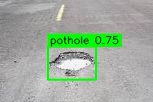

# Pothole Detection AI



Welcome!!

This is a computer vision model trained to detect potholes on roads.
This CV model has been trained to specifically only detect potholes.

## How to use this AI?

Firstly, to use this AI, you must clone it.
This can be easily done by clicking on the green "Code" button on the top, and then clicking the "Download Zip" button.

Or, you can run the following command in Bash:

```
git clone https://github.com/Nocluee100/Pothole_Detection_AI_YOLO
```


Then, when you unzip the file, head to the [weights](weights/) folder.
Then, you can either use [best.pt](weights/best.pt) or [last.pt](weights/last.pt). I would recommend using best.pt.

Then, you can use python script, such as the one given below, to run the CV model.

```
from ultralytics import YOLO

model = YOLO("weights/best.pt")
results = model("image.jpg")
results[0].show()  # Access the first result, then call .show()
```

## Imports

You will need to import ultralytics as this model is trained on YOLO.

You can import it by running this command in Bash:

```
pip install ultralytics
```


## License

The License for this AI is an MIT license. You can find it here: [License](LICENSE)

